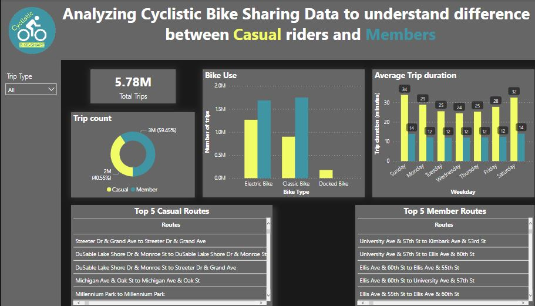

# Google-Data-Analytics-Capstone: How Does a Bike-Share Navigate Speedy Success?

A case study of the Google Data Analytics capstone project.

# Project Overview

The Google Data Analytics Capstone case study is the final project in the Google Data Analytics Professional Certificate program. The case study presents a scenario where I am tasked with analyzing bike-sharing data to understand how casual riders and annual members use Cyclistic bikes differently. The goal is **to identify how Cyclistic Casual riders are different from Members and provide recommendations to the executive team to maximize annual memberships and drive future success.** I used the Google Data Analytic framework (ASK, PREPARE, PROCESS, ANALYZE, SHARE, ACT) for the analysis.

### Technical skills I applied:

_Data cleaning, Exploratory Data Analysis, Data manipulation, Data interpretation, Data Visualization, Data Presentation_

# Ask Phase:

As a guide to answer the business task, I aimed to ask the following questions:
1.	Are there specific trends or patterns that distinguish the two user groups?
2.	How do casual riders and annual members differ in their usage patterns? 
3.	What actionable steps can be taken to encourage casual riders convert to annual memberships?

# Prepare Phase:

Cyclistic previous 12 months' trip data was used. The data collected was appropriate to answer the business task.

# Process Phase:

_Microsoft Excel_ and _Python programming_ were used to perform data transformation and Exploratory Data Analysis. 
Excel was used based on the instructions provided in the case-study guide to create two new columns (ride_length and day_of_week). 
Due to the large data size, I switched to using Python (Jupyter Notebook) in exploring the data further and performed analysis.
_Power BI_ was used to produce effective visualizations, particularly based on its Data Visualization capability.
_Google slide_ was used for Data Presentation.
To ensure data integrity for accurate, consistent, and reliable results, data processing was done in the following steps;
1. Data Exploration
2. Data cleaning
3. Data validation

**The data exploration** step explored each data file to know more detail about each data file using the following steps;
- I examined the details of each data file using pandas info and describe functions.
- I checked each data frame for duplicates.
- I checked each data frame for missing values.
- I validated the data to ensure proper analysis that informs data-driven decision

**Data cleaning** was done in the following steps;
- I renamed columns into conventionally meaningful names
- I handled missing values; the station names, station IDs, lat, and lng provide spatial information, and missing values in any of the columns can be corrected with values from corresponding columns. For rows with missing trip_duration values, I discovered the end dates were earlier than the start dates and made the assumption of an error in data entry. I interchanged the started_at and ended_at dates for rows with missing trip_duration and recalculated the trip duration in the trip_duration column.

**Data Validation** was done to validate the cleaning process and ensure the data are ready for further analysis, I performed the following steps on the cleaned data frame;
- Validated date consistency by ensuring the started_at is less than the ended_at for each trip.
- Validated data ranges for latitudes and longitudes values were within valid ranges for Chicago. Finding out through [this topographic map](https://en-us.topographic-map.com/map-c6m2/Chicago/) that the geolocation coordinates for Chicago, Illinois, United States range from latitude (41.64453° N to 42.02304° N) and longitude (87.94010° W to 87.52408° W).

# Analyze Phase:

Various metrics that differentiate casual riders from members based on the available data include; _Trip counts, Trip duration, Bike type, and Routes taken_.

These metrics were analyzed to differentiate casual riders from members. A summary report is shown below;

- _Trip counts_: Out of 5,776,703 trips, casual riders had 2,342,493 (40.55%) while member riders had 3,434,210 (59.45%). The count of trips taken by day of the week was consistent with Casual riders having lower trips than Members.
- _Trip duration_: The average trip duration for Casual riders was 28.88 minutes and 12.56 minutes for Members. Trip duration for Casual riders taken by day of the week was consistently higher than for Members.
- _Bike use_: Both casual riders and members use classic and electric bikes. However, docked bikes are not used by Member riders.
- _Routes use_: Top routes used by Casual riders and Members are different.

# Share Phase:

Findings:
_Trip counts_: Member riders had significantly higher ride counts compared to casual riders, indicating their higher level of engagement and regular use of the bike-sharing service.
_Trip duration_: Casual riders’ average trip duration was more than twice Member riders and consistent through each day of the week.
_Bike Use_: Member riders do not use Cyclistic docked bikes.
_Routes Use_: Routes preferred by Casual riders are different from the routes of Member riders. 

Visualization and Presentation were used to effectively communicate the findings and key takeaways.

**Visualization Report**

**Presentation slide** [here](Cyclistic_Bike_share_Presentation.pdf)

# Act Phase:

Actionable steps that can be taken in encouraging Casual riders to convert to annual memberships based on the findings include;
1.	Cost savings for long-term usage: Messages to Casual riders to consider annual memberships and showing how it’s more suitable by allowing them to enjoy extended rides without incurring additional costs. Cost-saving messages can persuade casual riders to become members.
2.	Improve Docked Bike Availability: For casual riders to become members, Cyclistic needs to consider improving docked bike availability and expanding the bike network in stations used by member riders. 
3.	Personalized membership messages along Popular Casual routes: Create personalized membership messages on social media platforms, to target locations and popular routes taken by casual riders. Such messages when seen can convince casual members to apply for membership.

Thanks for your time in reading. I hope to get you more excited looking at the notebook files for detailed documentation and code in the [**Jupyter notebook**](Jupyter_notebooks) folder!
